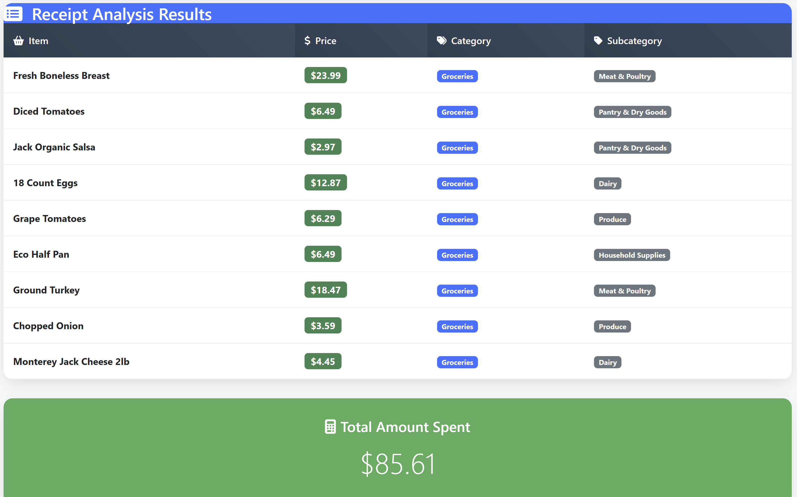
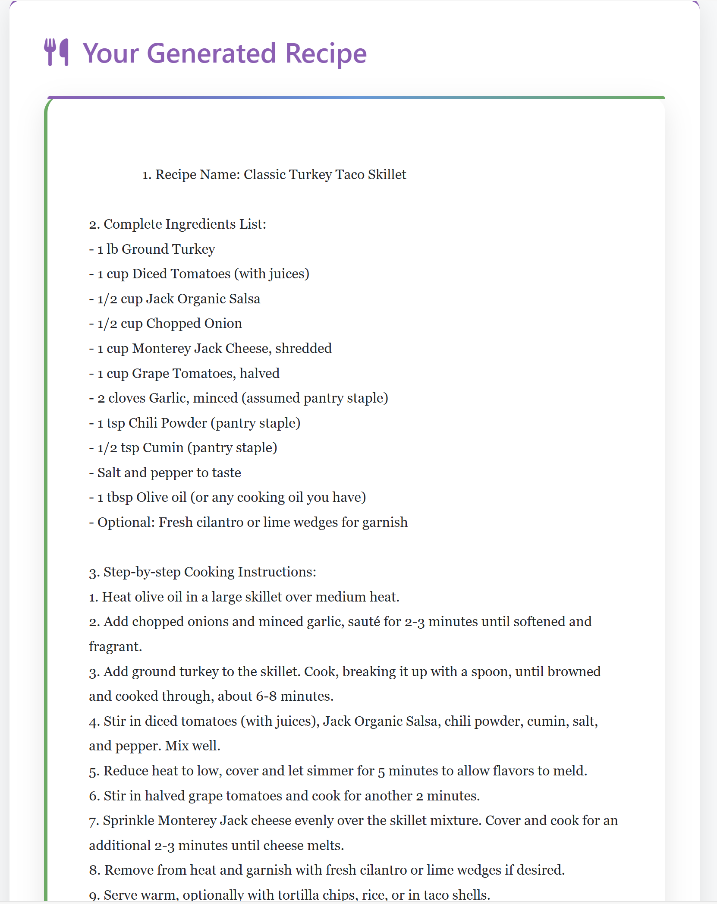
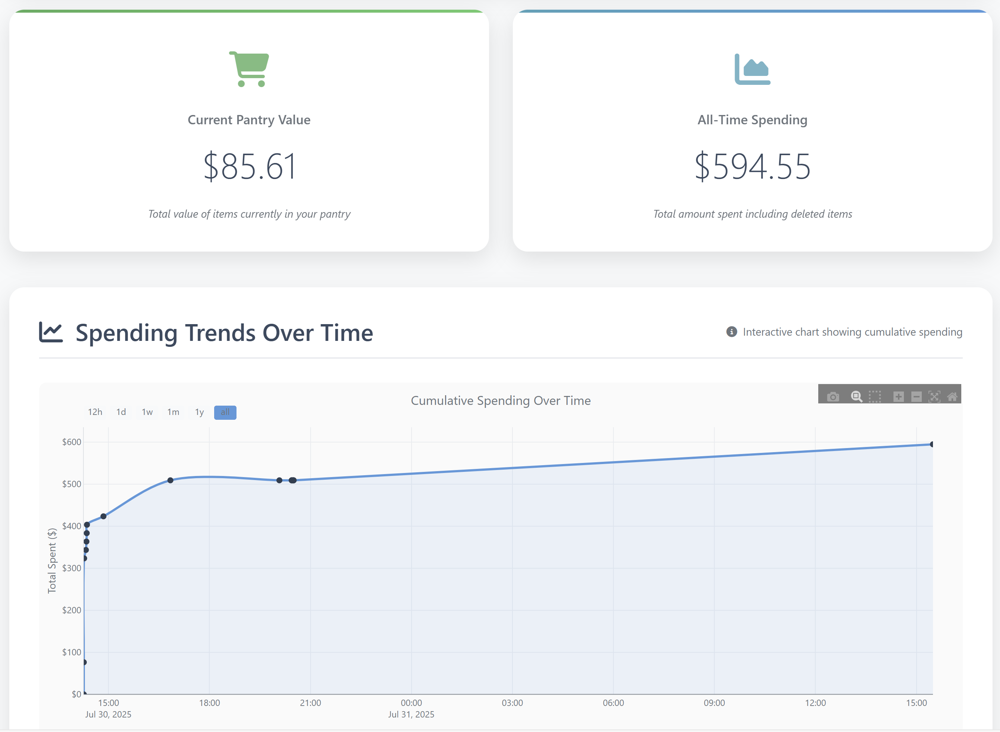
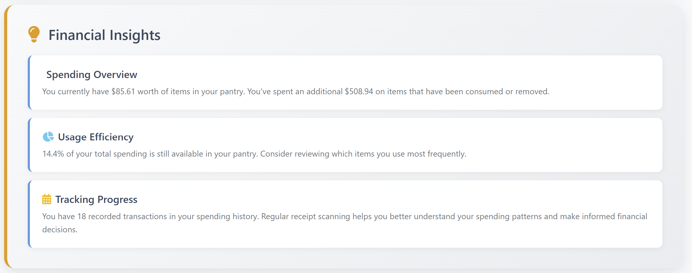

# Receipt Analyzer
> **Are you a college student with limited cooking experience?**
> **Do you often have leftover ingredients sitting in your kitchen?**

With this tool, you can easily generate recipe ideas using photos of your recent grocery receipts and keep track of your spending over time. Upload receipts for groceries, entertainment, shopping, or almost anything else to monitor your expenses and get personalized recipe suggestions based on what you actively have in your digital "pantry".

---

## Table of Contents
- [Overview](#overview)
- [Features](#features)
- [Technology Stack](#technology-stack)
- [Usage](#usage)
- [AI Capabilities](#ai-capabilities)

---

## Overview
Receipt Analyzer is a full-stack Flask-based web application that leverages Azure AI Document Intelligence, OpenAI GPT models, and data visualization tools to extract, classify, and analyze data from receipts. Users can upload receipts in various formats (PDF, JPEG, PNG, JPG), and the application automatically extracts data, categorizes spending, and generates personalized recipe recommendations based on items currently in their digital "pantry". A built-in financial tracker visualizes spending trends over time and provides intuitive insights to help users better understand and manage their expenses.

---

## Features
### 1. Receipt Upload & Analysis
  - Automated receipt data extraction using Azure AI Document Intelligence.
  - Clean and normalize product names with OpenAI GPT.
  - Categorize and subcategorize items (Groceries, Dining Out, Transportation, etc.).
  - Save receipt data into a SQLite database for persistent tracking.
### 2. Pantry Management
  - Track items currently in stock.
  - Add items manually and classify them with AI-powered duplicate detection and categorization.
  - Delete, search, and filter items by category, subcategory, and keywords.
### 3. Financial Dashboard
  - View current pantry value and all-time spending.
  - Explore spending trends over time with interactive charts.
  - Gain insights on usage efficiency and purchase patterns.
### 4. Recipe Generation
  - AI-powered recipe recommendations in two modes:
    - Use Only Pantry Items – generate recipes from what you already have.
    - Get Creative – broader recipe recommendations ignoring pantry limitations.
  - Special dietary or cuisine requests supported.
  - Save, view, and delete custom recipes.
### 5. User Authentication
- Secure login, signup, and profile editing.

---

## Technology Stack
- Backend: Flask (Python)
- Database: SQLite3
- AI Services:
  - Azure OpenAI for: Text cleanup and classification, AI-powered recipe generation
  - Azure Document Intelligence for: Receipt data extraction
- Visualization: Plotly.js, Matplotlib
- Frontend: HTML, Bootstrap

---

## Usage
1. **Clone into the repository:**
   ```bash
   git clone https://github.com/dandob1/Receipt_Analyzer.git
   ```
   ```bash
   cd Receipt_Analyzer
   ```
2. **Install dependencies:**
   ```bash
   pip install flask python-dotenv matplotlib pillow azure-ai-documentintelligence openai python-magic-bin
   ```
3. **Initialize the database:**
   ```bash
   python init_db.py
   ```
4. **Run the app:**
   ```bash
   python app.py
   ```
5. **Visit:**
    - http://localhost:8081
6. **Sign up as a new user**
7. **Upload Receipts:**
    - Sample receipts are provided in the `\uploads` folder.
8. **Manage your local pantry/generate recipes**
9. **View your financial trends over time**

---

## AI Capabilities
- **Receipt Item Extraction** – Extract items and prices from uploaded receipts using Azure Document Intelligence.  
- **Data Cleaning & Normalization** – Normalize messy OCR text into human-friendly product names.  
  > _Example_: `"ORGANIC RND YELLOW TORT. CHIPS"` → `"Organic Yellow Tortilla Chips"`
  
  > _Example_: `"GHRDL CAB MATINEE"` → `"Ghirardelli Matinee Chocolate"`  
- **Smart Categorization** – Automatically assign items to categories and subcategories (e.g., Groceries → Produce, Meat, Beverages).  
- **Duplicate Detection** – Warn users when adding items that already exist in their pantry.  
  > _Example_: entering `"granny smith apple"` warns about adding `"green apple"`.  
- **Recipe Generation & Personalization** – Generate recipes using pantry contents and optional dietary or cuisine requests.  
- **Spending Insights** – Enable detailed spending analytics by classifying expenses and producing category-based trends.

## Screenshots
### Upload Receipt and Generate Recipe
<p float="left">
  
  
</p>

### Financial Data and Insights
<p float="left">
  
  
</p>
